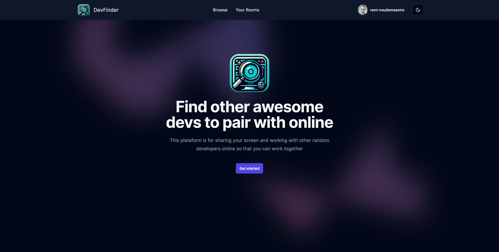

# Dev Finder

<!-- [https://remimeullemeestre.dev](https://remimeullemeestre.dev) -->

## Description

This is a fullstack screen sharing application with room creations, editing and deleting, filtering, authentication and authentication based authorization, including many UI components like dialogs, toasts, dropdown, etc.



## Stack

- [Next.js](https://nextjs.org) - Next.js by Vercel is the full-stack React framework for the web. Production grade React applications that scale. The world's leading companies use Next.js by Vercel to build static and dynamic websites and web applications.
- [React.js](https://react.dev) - The library for web and native user interfaces. Build user interfaces out of individual pieces called components written in JavaScript. React is designed to let you seamlessly combine components written by independent people, teams, and organizations.
- [TypeScript](https://www.typescriptlang.org) - TypeScript is a strongly typed programming language that builds on JavaScript, giving you better tooling at any scale. Learn how to use TypeScript with editor checks, auto-complete, interfaces, JSX, const, and more.
- [Tailwind](https://tailwindcss.com) - Tailwind CSS is a framework that lets you build any design, directly in your HTML, with classes like flex, pt-4, text-center and rotate-90. It is easy to customize, scalable, and has a large community of adopters and creators who love its speed, flexibility and design-first approach.
- [Shadcn/ui](https://ui.shadcn.com) - shadcn/ui is a website that offers beautiful and customizable UI components that you can copy and paste into your apps. You can also access your GitHub repositories and issues from the website, and see the latest updates from other users.
- [NextAuth.js](https://next-auth.js.org) - NextAuth.js is an open source library that provides easy and flexible authentication for Next.js applications. It supports popular services, email, passwordless, OAuth, and more.
- [PostgreSQL](https://www.postgresql.org) - PostgreSQL is a powerful, open source object-relational database system with over 35 years of active development. Learn how to install, use, and engage with PostgreSQL through official documentation, community events, mailing lists, and news.
- [Drizzle ORM](https://orm.drizzle.team) - Drizzle ORM is a lightweight and performant TypeScript ORM that supports any database and runtime. It has zero dependencies, no code generation, and hassle-free SQL migrations.
- [Stream](https://getstream.io) - Carefully Designed APIs and Component SDKs. We obsess over API ease of use and provide extensive tutorials for both feeds and chat. This is why our customers typically integrate in days while competing solutions take months to launch. Instead of just telling us a price and a plan, Stream is committed to 

## Project structure

```
$PROJECT_ROOT
│   # Static files
├── public
│   # Source folder
└──src
    │   # Api NextAuth file
    ├── api
    │   # Browse page related files and actions
    ├── browse
    │   # Create room related files and actions
    ├── create-room
    │   # Edit page related files and actions
    ├── edit-room
    │   # Room page related files and actions
    ├── rooms
    │   # Rooms page related to a user files and actions
    ├── your-rooms
    │   # ShadCN and reusable components
    ├── components
    │   # Functions to access and process data
    ├── data-access
    │   # Connexion to DB and schemas
    ├── db
    │   # Next Auth config and utils
    └──lib
```